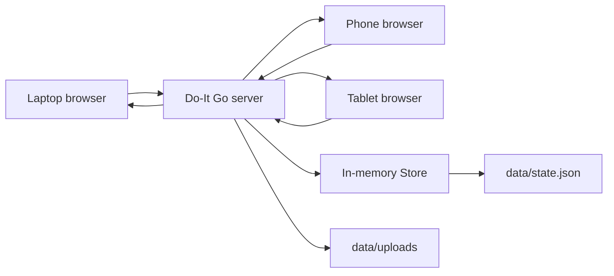
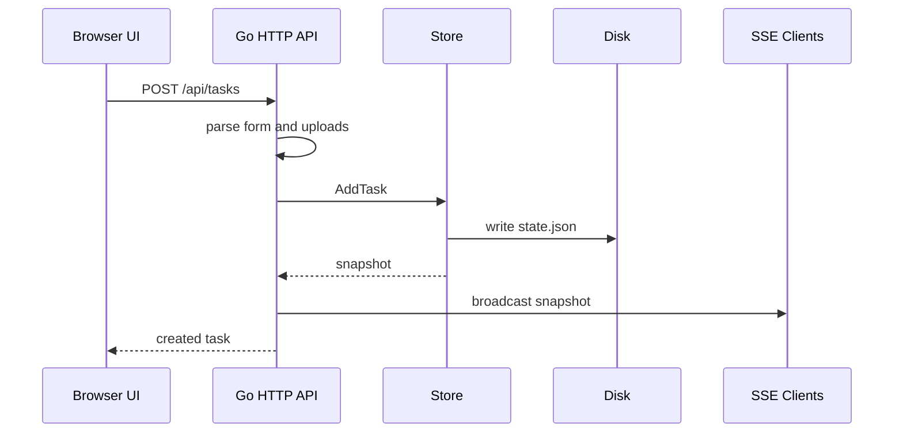

# Architecture

Do-It is currently a single-process LAN app. One Go process owns the data, serves the UI, receives writes, persists state, and pushes live updates to every open browser.

## System Diagram



## Core Idea

The server is the source of truth. Browsers do not write to local browser storage. A browser sends a write request, the server updates the shared store, writes the new state to disk, and broadcasts a fresh snapshot to all connected browsers.

That gives us simple consistency:

1. One process owns mutations.
2. One mutex protects the in-memory task map.
3. One JSON file stores durable task state.
4. One live stream keeps browsers synchronized.

## Runtime Components

### `main.go`

`main.go` is the boot file:

- Reads environment variables.
- Chooses the listen address.
- Chooses the data directory.
- Creates the store.
- Embeds and serves the frontend.
- Starts the HTTP server.

Important environment variables:

```text
DOIT_ADDR       default :8080
DOIT_DATA_DIR   default data
```

### `store.go`

`store.go` owns durable task state.

Main types:

```go
type Task struct {
    ID          string
    Title       string
    Notes       string
    ParentID    string
    Done        bool
    Attachments []Attachment
    CreatedAt   time.Time
    UpdatedAt   time.Time
}
```

`ParentID` is what turns a normal todo list into a graph. A task with no parent is a root node. A task with `ParentID` becomes a child node connected to another task.

The store uses:

```go
sync.RWMutex
map[string]Task
```

The mutex matters because HTTP handlers run concurrently in Go. Two devices can click at the same time, so writes must be protected.

Persistence uses a safer pattern:

1. Marshal the full state to JSON.
2. Write to `state.json.tmp`.
3. Rename the temp file to `state.json`.

That avoids many partial-write problems.

### `server.go`

`server.go` owns the network boundary.

Main responsibilities:

- Register routes.
- Validate requests.
- Save uploaded files.
- Convert store errors into HTTP responses.
- Track live browser sessions.
- Push Server-Sent Events.
- Report LAN URLs and connected devices.

### `static/`

The frontend is intentionally dependency-free:

- HTML for structure.
- CSS for the monochrome/translucent visual system.
- JavaScript for API calls, live sync, graph layout, and rendering.

This keeps the first version easy to reason about. A framework can come later if the UI grows enough to justify it.

## Request Flows

### Create Task



### Live Sync

The browser opens:

```text
GET /api/events
```

That connection stays open. The server sends events like:

```text
event: snapshot
data: {...}

event: devices
data: {...}
```

Why Server-Sent Events instead of WebSockets for this stage:

- The browser API is tiny.
- Server implementation is simple.
- Normal HTTP requests still handle writes.
- It fits one-way server-to-browser updates well.

WebSockets become useful if we need high-frequency bidirectional interaction later, such as collaborative cursor movement or drag streaming.

### Device Presence

Every active browser tab with `/api/events` open is a live session. The browser keeps a generated client ID in local storage and passes it to the live stream. The server uses that ID to group tabs from the same browser into one device. If the ID is missing, it falls back to:

```text
remote IP + user agent
```

That means:

- One phone with one tab usually shows as one device with one tab.
- One laptop with two app tabs shows as one device with two tabs.
- If a tab closes, the SSE connection ends and the device status updates.

This is runtime status only. It is not saved to `state.json`.

Browsers also report best-effort device health through:

```text
POST /api/client-status
```

The current health signals are:

- Browser online/offline state from `navigator.onLine`.
- Battery percent and charging state when `navigator.getBattery` is available.
- Effective network type, downlink, and RTT when the Network Information API is available.

These APIs are browser-dependent. Chrome-based Android browsers usually expose more than Safari or Firefox. The app shows `unknown` when a browser refuses or does not support a signal.

### File Sharing

Files are sent through multipart form upload:

```text
POST /api/tasks
```

The server stores files under:

```text
data/uploads/
```

The task stores metadata:

```text
name, URL, content type, size, created time
```

Images are previewed in the inspector. Other files are linked.

## API Details

| Method | Path | Purpose |
| --- | --- | --- |
| GET | `/api/tasks` | Return current task snapshot |
| POST | `/api/tasks` | Create a task, optionally with files |
| PATCH | `/api/tasks/{id}` | Update title, notes, parent, or done state |
| DELETE | `/api/tasks/{id}` | Delete a task |
| GET | `/api/events` | Open live SSE stream |
| GET | `/api/devices` | Return connected devices |
| POST | `/api/client-status` | Update browser-reported battery/network health |
| GET | `/api/network` | Return LAN URLs detected by server |
| GET | `/uploads/{file}` | Serve uploaded file |

## Why Not gRPC Yet?

Raw gRPC is great between backend services or native clients, but browsers do not talk raw gRPC directly without a compatibility layer.

Good future options:

- Keep REST/SSE for browser and add gRPC for CLI/native clients.
- Use Connect-Go for browser-friendly RPC.
- Use gRPC-Web with a proxy or compatible server.

For the current product, HTTP plus SSE is simpler and easier to debug while learning Go networking.

## Current Limits

- JSON persistence is simple but not ideal for large data.
- No authentication yet, so keep it on a trusted LAN.
- Uploads are local to one server device.
- Device presence is approximate because it uses IP plus user agent.
- No offline edit queue yet.

## Next Architecture Upgrades

Best order:

1. SQLite persistence.
2. Pairing code or local auth.
3. Better backup/export.
4. Drag-to-reparent graph nodes.
5. Optional gRPC/Connect-Go API.
6. mDNS discovery, so devices can open `doit.local`.
